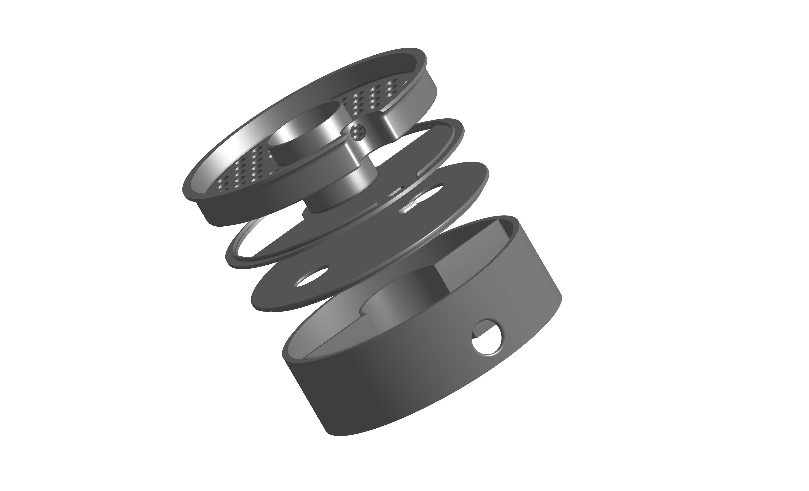
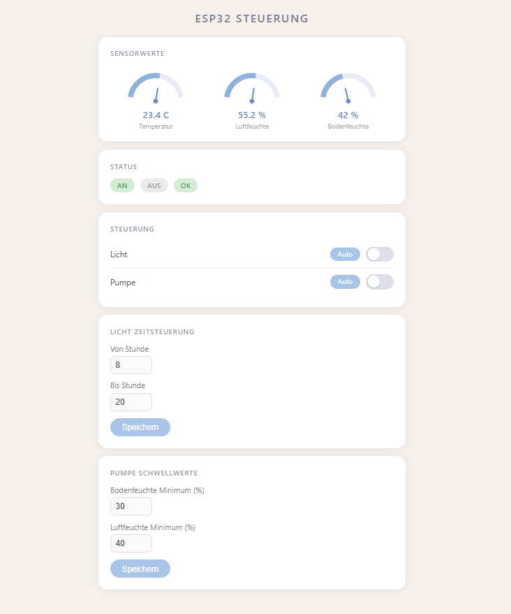

# AUTER — Automatisches Terrarium

&gt; **Smarte Hardware- &amp; IoT-Lösung für ein vollautomatisches Terrarium** mit Mikrocontroller-Steuerung (C++), integriertem Bewässerungs-/Drip-System, Sensorik und eigenem Web-Dashboard [1].

---

## Inhaltsverzeichnis
- [Über das Projekt](#über-das-projekt)
- [Highlights &amp; Features](#highlights--specs)
- [Hardware &amp; Redesign (v2 in Arbeit)](#hardware--redesign-v2)
- [3D-Druck &amp; CAD-Komponenten](#3d-druck--cad-komponenten)
- [Software &amp; Web-Dashboard](#software--web-dashboard)
- [Bildergalerie](#bildergalerie)
- [Repository-Struktur](#repository-struktur)
- [Autor](#autor)

---

## Über das Projekt

**AUTER** (Automatisches Terrarium) wurde entwickelt, um Befeuchtung, Belüftung und Beleuchtung in einem geschlossenen Pflanzen-Ökosystem vollständig zu automatisieren [1]. Die Steuerung übernimmt ein C++-basierter Mikrocontroller, welcher die Klimawerte überwacht und Stellglieder wie Sprühdüsen (*Nozzles*) und Lüfter steuert [1].

---

## Highlights &amp; Specs

- **Automatisierte Befeuchtung:** Tröpfchen- &amp; Düsensystem (*Drip Layer &amp; Nozzle*) für präzise Bewässerung [1].
- **Web-Dashboard:**Echtzeit-Überwachung und Steuerung der Terrarium-Parameter über ein Web-Interface (`WebDashboard.png`) [1].
- **Embedded C++ Software:** Performance-optimierte Firmware zur Sensor-Auslesung und Aktor-Steuerung [1].
- **Modularer CAD-Aufbau:** Maßgeschneiderte 3D-Druck-Ebenen für Technik, Düsen und Gehäusedeckel [1].

---

## Hardware &amp; Redesign (v2)

### Lessons Learned aus v1
In der ersten Version war das System voll funktionsfähig, litt jedoch unter der extrem hohen Luftfeuchtigkeit im Innenraum. Durch Feuchtigkeitsniederschlag korrodierten empfindliche Elektronikbauteile im Laufe der Zeit.

### Optimierungen in Version 2 (In Entwicklung)
- **Kapselung der Technik:** Vollständige räumliche Trennung der Elektronik/Platinen vom feuchten Terrarien-Innenleben.
- **Verbesserte Belüftung:** Überarbeiteter Technik-Deckel mit vergrößerten Lüftungsschlitzen zur effektiven Entfeuchtung der Steuerungs-Ebene und zur Förderung des Pflanzenwachstums.

---

## 3D-Druck &amp; CAD-Komponenten

Die mechanischen Komponenten sind modular aufgebaut und als `.step`- sowie `.stl`-Dateien im Repository hinterlegt [1]:

| Baugruppe | Funktion / Beschreibung | Dateiformate |
| :--- | :--- | :--- |
| **AUTER Deckel** | Hauptabdeckung mit integrierten Lüftungsauslässen | `.step` / `.stl` / `.png` [1] |
| **Tech Layer 1 &amp; 2** | Zweistufige Halterung für Sensorik, Controller &amp; Verkabelung | `.step` / `.stl` / `.png` [1] |
| **Drip Layer** | Verteiler-Ebene für die gleichmäßige Bewässerung | `.step` / `.stl` / `.png` [1] |
| **Nozzle (Düse)** | Passgenaue Sprühdüsen-Halterung für den Innenraum | `.step` / `.stl` / `.png` [1] |

---

## Software &amp; Web-Dashboard

Die Firmware ist komplett in **C++** geschrieben [1]. Sie liest die Sensordaten aus und kommuniziert mit dem **Web-Dashboard**, über das Grenzwerte angepasst und manuelle Schaltungen vorgenommen werden können (`WebDashboard.png`) [1].

---

## Bildergalerie



*Gesamtaufbau des automatischen Terrariums.*


*Impressionen des Terrariums und der Pflanzen-Vase.*



*Web-Dashboard zur Kontrolle der Sensordaten und Aktorik.*

---

## Repository-Struktur

```text
├── AUTER/                      &lt;- C++ Quellcode / Firmware
├── AUTER_Deckel.png / .step / .stl
├── AUTER_Drip_Layer.png / .step / .stl
├── AUTER_Nossel.png / .step / .stl
├── AUTER_Tech_Layer_1.png / .step / .stl
├── AUTER_Tech_Layer_2.png / .step / .stl
├── AUTER_Vase_1.jpeg
├── AUTER_Vase_2.jpeg
├── WebDashboard.png
└── README.md

```

---

## Autor

**Daniel Fast** ([@Minielel](https://www.google.com/url?sa=E&amp;q=https%3A%2F%2Fgithub.com%2FMinielel))[3]

* **Portfolio:** [daniel-fast.de](https://www.google.com/url?sa=E&amp;q=https%3A%2F%2Fwww.daniel-fast.de)
